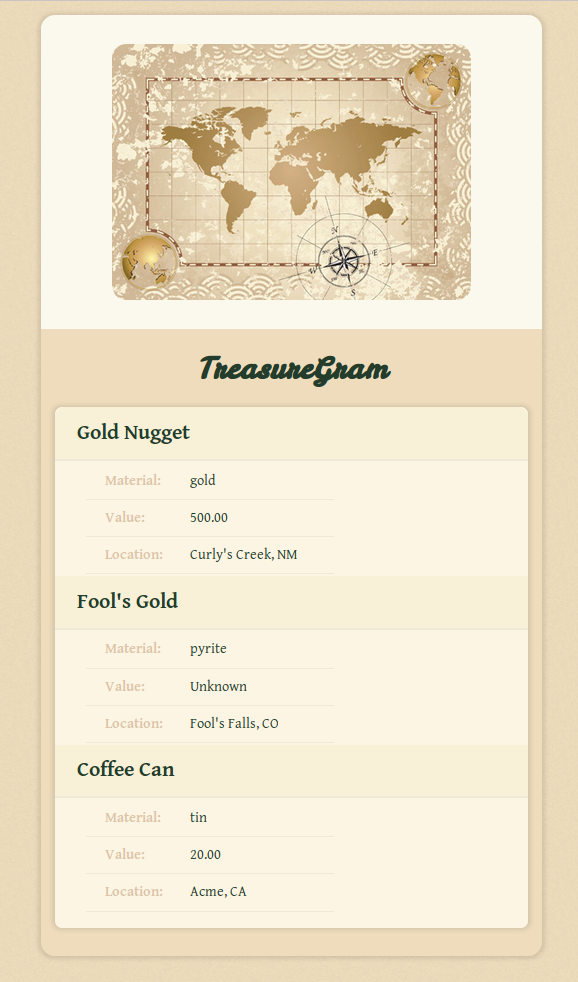

# Treasure Gram



A project to play with Django.

This project was created with Python 3.4 and Django 1.10.0.


## To run the site locally

Clone the repo and install all dependencies:

```bash
cd treasure-gram/Treasuregram
pip install -r requirements.txt
```

Run the migrations:

```bash
python manage.py makemigrations
python manage.py migrate
```

Then start the server:

```bash
python manage.py runserver
```

And go to <http://localhost:8000/>


## Concepts covered

* Database migrations
* Static files
* Routes and settings
* Passing contexts
* Templating language
* Template inheritance
* Form-Model mapping and sending data to the server
* Image uploading
* Registering admin with models
* One to many relationship User-Treasures
* User pages
* User authentication
* AJAX communicating with views
